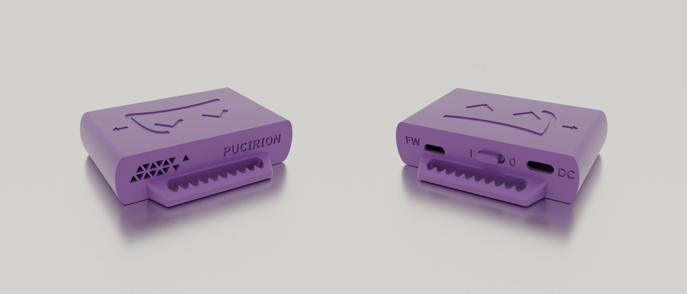

# Pucirion for DIY SlimeVR
Pucirion is [Hyperion](https://github.com/Smeltie/Hyperion) case edit for DIY SlimeVR.

Modifications:
- Stronger handles with teeth that better hold a strap in place.
- Less rounded edges make it smaller and easier to print.
- Access to MicroUSB port.
- Redesigned vent

This repository contains only modified case STL files. Check out the repository of original project for other required files and instructions:

https://github.com/Smeltie/Hyperion
